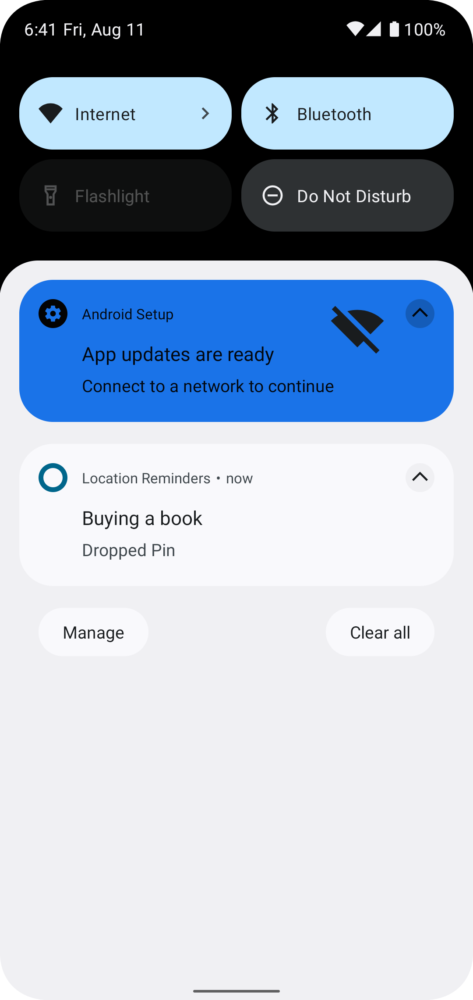

# About
A TODO list app with location reminders that remind the user to do something when the user is at a specific location. 
The app will require the user to create an account and login to set and access reminders.

## Implemented using
* Koin dependency injection
* Firebase Authentication
* Google Maps
* Geofences
* MVVM
* Coroutines
* Testing using Espresso and Mockito
* Room database
* Recycler view

## Screens

  
   
  
                           
  
  
  
  
  
                                            

  

## Google API key
Specify the api key in local.properties as
GOOGLE_MAPS_API_KEY = api key
